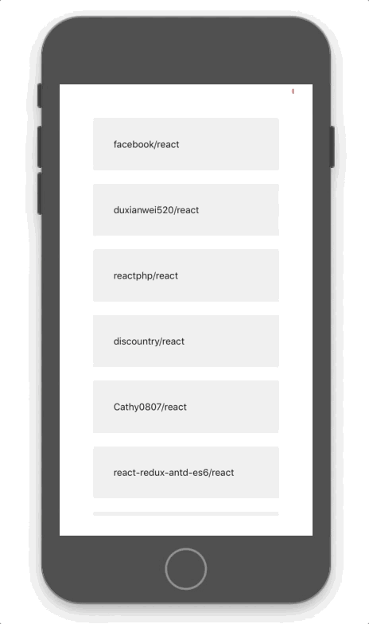

<h1 align="center">Loading-Infinito-React-Native</h1>
- Este app foi desenvolvido somente para testes de loading, aonde ele carrega repositorios da API
do github, 20 deles por vez, sendo aplicado o efeito de load infinito ao chegar ao fim da lista.

## 💻  Uma simples lista com loading infinito.

<p align="center">

</p>

## Créditos
```sh
- https://blog.rocketseat.com.br/scroll-infinito-no-react-native/
```

## 🎩 Como fazer funcionar

 - Instale as dependências:
```sh
yarn
```
 - Rode o projeto:
```sh
react-native run-android / react-native run-ios
```

Boa Sorte.
